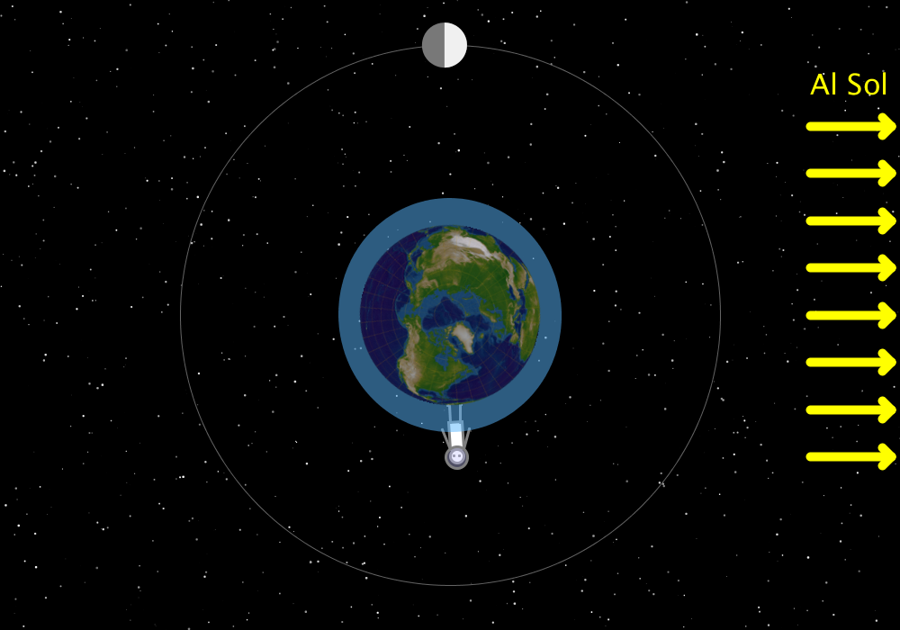

# Tides
This interactive program allows for showing the Ebb and Flow of the tides and how they relate with Solar and Lunar positions. You can move the mouse around to change the position of the Moon in its orbit and see how the oceans change accordingly.

### Neap Tide

### Spring Tides
In here you can see the water level with respect to the astronaut.

