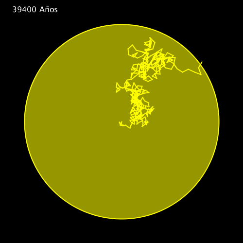

# Photon Escape
This program shows a simulation of a Photon escaping the interior of a star after thousands of years of interaction with the stellar interior. The program stops when the photon finally manages to escape, and can be restarted by pressing the spacebar.

