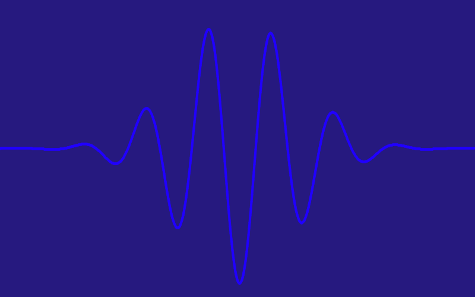
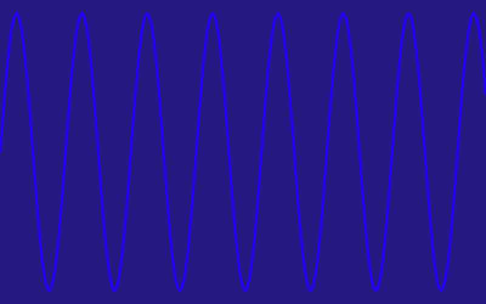
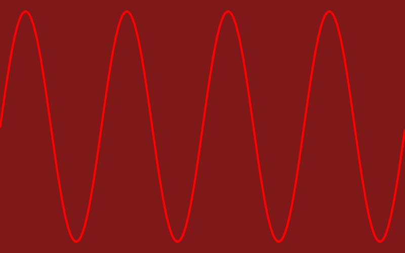

# Photon Visualization

This code allows for visualization of the dual structure of a particle of light. Although the representation here shown is not physically accurate, due to the fact that one cannot "see" photonic structure, it somewhat resembles the mathematical characteristics of said entities: Wavelenght, frequency, gaussian wavefunction shape, and color. 

The program is interactive through the arrow keys: Left/Right for respectively increasing or decreasing wavelenght (and color accordingly). The Up key for switching between Single Photon and Photon Ray. And the Down key for enabling animation.

### Single Photon
Here we see a couple of shots for a single particle of light. Again, this does not represent accurately a photon, but it's instead a visualization of how a Photon behaves as a wave and as a quantum particle:
 

### Photon Ray
Here again, a ray of monochromatic photons (or laser) displaying their wave properties:
 
