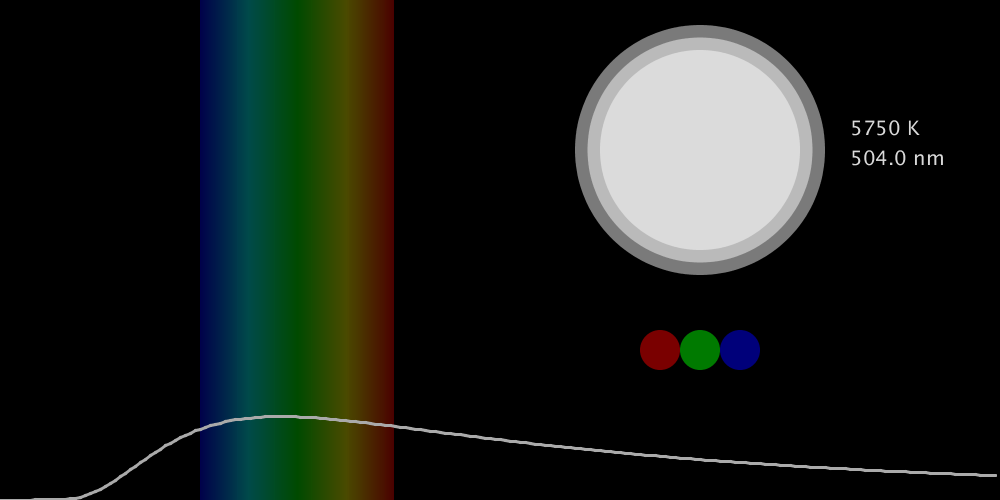
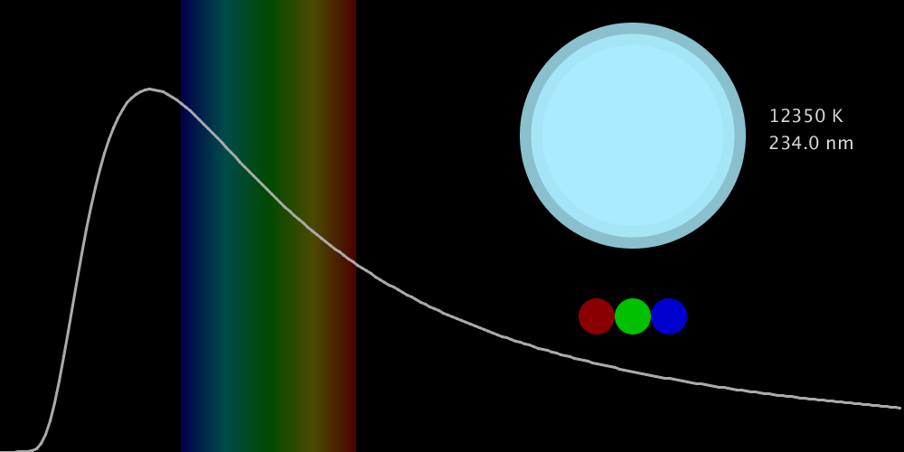

# Planck Emission Law
This interactive code shows the radiation curve of a blackbody according to Planck's Law. You can raise or lower the temperature with the side arrow keys, stop the temperature with the Down arrow key, and reset it to 3000K with the Up key. You can also see the color a body would have based on its temperature:

